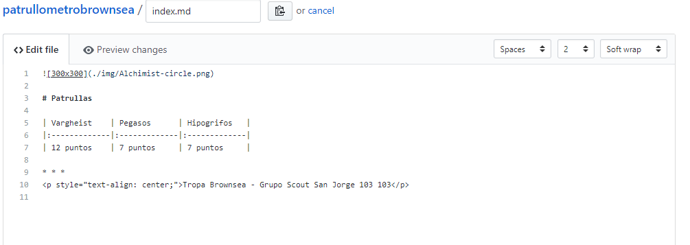

# Léeme.

## GitHub.

Sed Bienvenidos a GitHub, una plataforma que sirve de repositorio para proyectos y páginas a informáticos tanto particulares como profesionales, así como a grandes empresas que usan sus servicios. Github es una plataforma libre, en la cual todo el mundo puede colgar sus proyectos (de forma pública) totalmente gratis. Si los contenidos se hacen privados hay que pagar.
 * * *
 
 ## Cómo Funciona este repositorio.
 
 
 
 En este repositorio podemos encontrar una lista de varios ficheros. Los hay de tipo **.yml, .md y sin extensión**.
 Los ficheros sin extensión o de tipo .yml son archivos de configuración interna de la página, por lo que no nos interesan; los que utilizaremos son los ficheros .md, que están escritos en un lenguaje llamado ***Markdown***.
 
 ### Markdown.
 
 Cuando escribes en Markdown en vez de utilizar las clásicas teclas como las del editor de texto para poner los encabezados, las negritas y las imágenes, utilizas otras formas.

 > Para ver la sintaxis Markdown visita https://markdown.es/sintaxis-markdown/
 
 ## Editar el Patrullómetro.
 
 El patrullómetro está incluido en el fichero <./index.md>, el cual encontrarás en la lista de elementos de éste repositorio. Al abrirlo encontrarás el mismo contenido de la página web pero sin maquetar. Para editar el documento tendrás que hacer click en el Lápiz que aparece en la barra superior del fichero.
 
 
* * * 

Una vez pulsado el lápiz podremos editar el documento en formato Raw o Crudo, es decir, en Markdown puro y duro.
Encontraremos una especie de tabla hecha con guiones y barras verticales como la que se ve en la imagen.

La editamos y una vez editada nos dirigiremos a la parte inferior de la página, en la cual encontraremos el siguiente recuadro:

En este recuadro debemos introducir en el primer campo la fecha en la que se realiza la edición y en el segundo (opcionalmente) algún comentario que quiera hacerse al respecto. Esto servirá para mirar los cambios y la evolución de los puntos o de la web. Finalmente pulsamos en ***Commit changes*** y la edición estará lista.

> Aseguraos siempre que la opción de guardado es la denominada *Commit direcctly to the master branch.*
